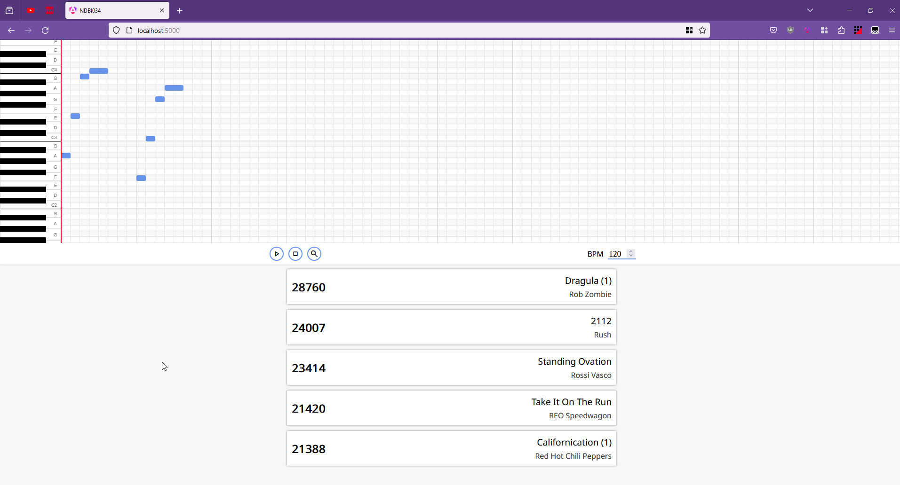

# Melody search

This project allows users to search for songs using a simple melody editor. The search utilizes
[TWLCS](http://dub.ucsd.edu/CATbox/Reader/TWLCS.pdf) over a
database of monophonic melody MIDI files. These were extracted from the [Lakh MIDI Dataset](https://colinraffel.com/projects/lmd/)
(more specifically the clean MIDI subset) using the algorithm described [here](https://ieeexplore.ieee.org/document/1565863).

## Frontend

All commands should be executed in the `/frontend` folder.

### Environment

- Node.js 18
- `npm i`

### Other commands

- Dev server: `npm run start` (by default localhost:4200)
- build: `npm run build` (this builds the site and puts it into the flask static folder)

## Backend

All commands should be executed in the root folder.

- Python 3.11
- `pip install -r requirements.txt`
- server: `python -m flask --app backend run` (by default localhost:5000)

The extracted melody MIDIs belong to `/backend/static/melody_midi`. Part of the backend code
is written in C, so for the `pip install` you should have some C compiler installed on
your machine.

## Usage

Draw your melody query using the piano keys widget. You can move the notes around by dragging them or
resize them, but it is not possible to overlap them. Click the search button to display the results (might take some time).

### Example session

